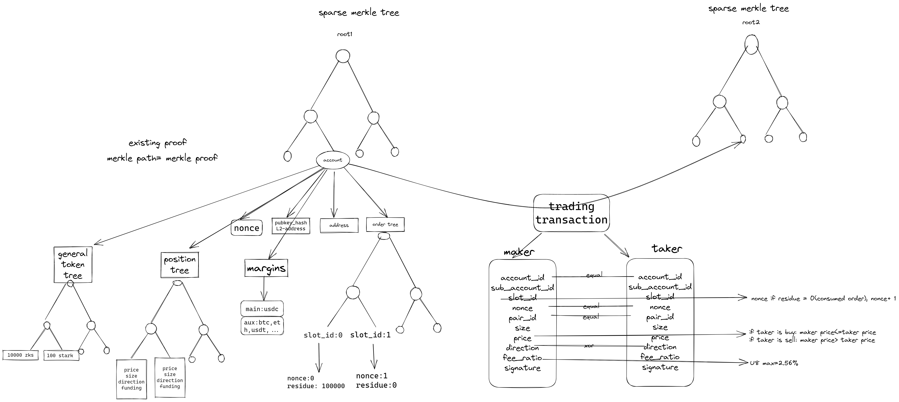
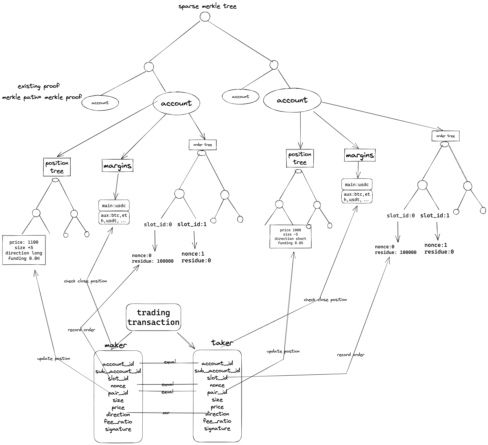
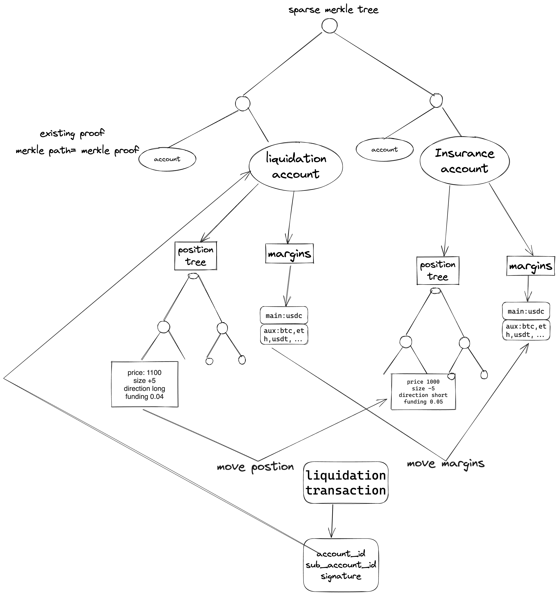
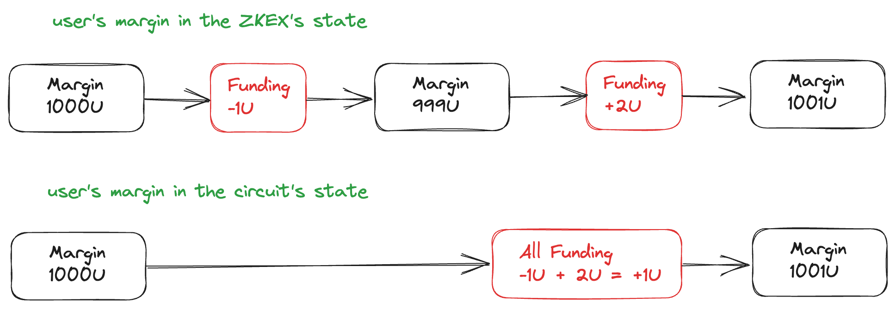

# Perpetual Design Doc

## Product Features

* CEX-like Experience: Compatible with AA Wallet (email/password login), multi-chain asset aggregation
* Industry-leading features: Unified account, portfolio margin

## Overall Design of State Tree




## Base Operation 
|Operation | Comment|
|----|-----|
|Deposit|Layer1 priority instruction| 
|Withdraw|Layer2 instruction, user-initiated withdrawal|
|Transfer|Layer2 instruction, user-initiated internal transfer within Layer2|
|ChangePubKey|Layer2 instruction, user initializes Layer2 Private Key|

## Business Operation
* Business instructions include basic trading instructions for spot and derivatives, as well as instructions specifically designed for derivatives such as forced liquidation, ADL, and funding fees.
* To achieve decentralization, a Layer1 priority instruction, ForceLiquidation, is designed to ensure the fairness of forced liquidations.

### Account Slot
To enable concurrent order placement, zkLink has designed the Account Slot feature.

Each account has 65536 order slots, and each slot has a corresponding nonce, for example:

| Slot0 | Slot1 | Slot2 | Slot3 | Slot4 | Slot5 | Slot6 | Slot7 | ...  | Slot65535 |
| ----- | ----- | ----- | ----- | ----- | ----- | ----- | ----- | :--- | :-------- |
| 0     | 2     | 4     | 0     | 7     | 9     | 23    | 1     |      | 122       |

When placing an order, users can choose any available slot, where an available slot refers to a slot that is not occupied by any other order. For example, if slot 5 is available, the nonce of the order will be the current nonce of slot 5 plus 1 (similar to the principle of account nonce). With 65536 slots, up to 65536 orders can be placed simultaneously, which can meet the needs of the majority of users.

To support partial fills, each slot also keeps track of the remaining quantity of the order. For example, if the current order in slot 5 needs to sell 1000 USDT but only 800 USDT has been filled, when there is another order matching that order, at most 200 USDT can be filled.
In addition to nonce and remaining amount, the order's sig hash is also recorded for comparison with future orders.


### SpotTrade
* The circuit stores: Token balances
* The circuit verifies: user signatures, order quantity matching (buy and sell quantities are equal), reasonable price (execution price is better than the order price)


### PerpTrade
* The circuit stores: Opening average price, position, direction
* The circuit verifies: user signatures, order quantity matching (long and short positions are equal), reasonable price (execution price is better than the order price)



### Liquidation
* ZKEX specifies the account ID and notifies Layer2 to execute liquidation checks
* The circuit needs to verify that the margin ratio meets the liquidation conditions

```js
circuit_assert( (margin_value + PnL) / maintenance_margin < 1)
```


### ForceLiquidation
* Permissionless instruction initiated by Layer1 (must be processed by Layer2)
* Design purpose: Prevent operators from subjectively or inadvertently omitting accounts that should be liquidated
* By specifying the corresponding account ID, force Layer2 to perform forced liquidation for specific users

```js
function forceLiquidation({ account_id: uint256 }){
    require(msg.value >= v˚ ); // v˚ is the minimum required commitment amount to prevent attack behavior
    `add to priorityOpList` 
}

function executeBlock(){
    //…
    // if forceLiquidation is valid, refund v˚ to force_liquidation_user
    //…
}


```
### ADL

* ZKEX specifies the account ID and notifies Layer2 to perform ADL checks
* The circuit needs to verify if the account subject to ADL meets the conditions: ensure rPnL > 0 after deleveraging

```js
circuit_assert(insurance_margin_value + insurance_PnL < 0)
if (position.direction>0){
	circuit_assert(deleverage_price > entry_price)
} else {
	circuit_assert(deleverage_price < entry_price)
}

```

### Oracle
* Collect data from multiple data providers and take the median
* Data structure: timestamp, prices for multiple currencies
* The circuit verifies: Oracle signatures, timestamp incrementation
```json
{
    "price":[
        "0x2ab34",
        "0x2ab34"
    ],
    "timestamp": 1684947631272,
    "signature": "0xFF…FF"
}

```

### Funding
* Using the cumulative funding fee approach to save system operational costs and improve asset security.
* Layer1 smart contract method, priority transaction (must be processed by Layer2), restricted execution (Validator), smart contract constraints on the time range and maximum change value of the two submissions.



```js
function funding(
  {new_funding_rate: uint256}
){

    ∆ƒ = last_funding_rate - new_funding_rate;
    ∆t  = last_update_time - current_time;
    require( |∆ƒ| < ƒº, `reject` ); // ƒº is the maximum change value of the funding fee rate
    require( ∆t >= 1h, `reject` ); // Higher update frequency effectively prevents possible contract price manipulation for illiquid assets
    require( ∆t <= 14d, `go to exodus mode` )
    last_funding_rate = new_funding_rate;
    last_update_time = current_time;

}

```
